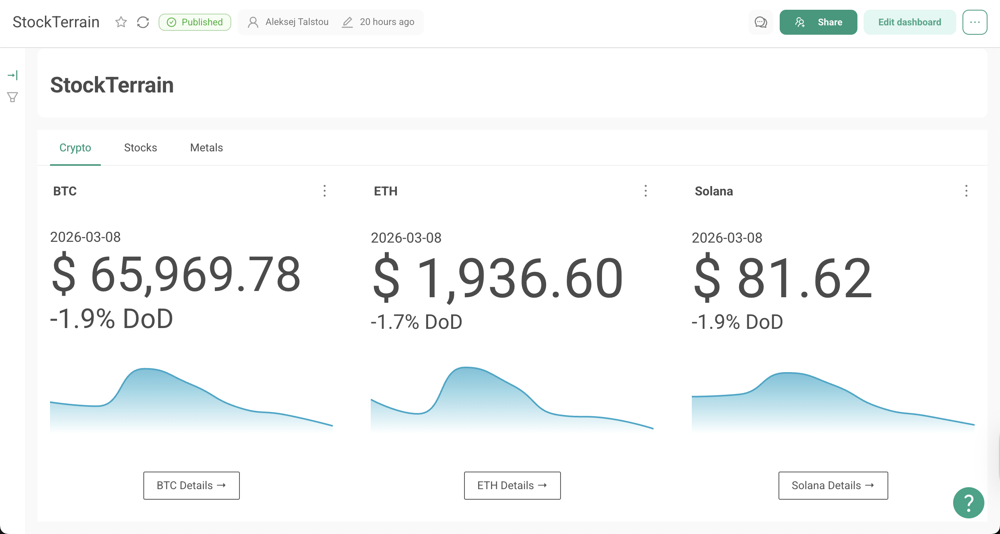
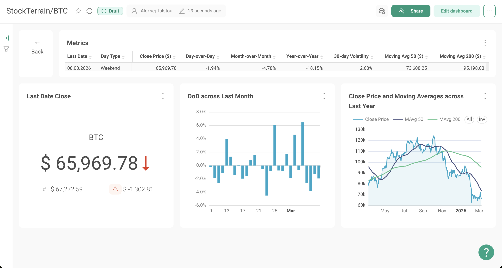

# StockTerrain – Market Analytics Platform
### Automated financial data pipeline and dashboards built with AWS, dbt, and Preset

## Project Description
This project implements an end-to-end data pipeline for market analytics using a modern cloud data stack. Daily price data from the Yahoo Finance API is ingested via AWS Lambda, stored in Amazon S3, and cataloged with AWS Glue for querying in Amazon Athena.

Data transformations and financial indicators are built with dbt and executed through GitHub Actions, while AWS Step Functions orchestrate the workflow. The processed dataset powers interactive dashboards in Preset (Apache Superset), providing insights into price trends, returns, volatility, and moving averages across cryptocurrencies, commodities, and major stock indices.

## Architecture Diagram

## Preset Dashboards
  

## Tools and Technologies
- **AWS**: Lambda, S3, Glue, Athena, Step Functions  
- **Terraform**: Infrastructure as code for AWS resources  
- **dbt**: Data transformations and modeling  
- **GitHub Actions**: CI/CD for dbt runs  
- **Python**: Data ingestion via yfinance  
- **Preset (Apache Superset)**: Interactive dashboards and visualization

## Author
Aleksej Talstou

