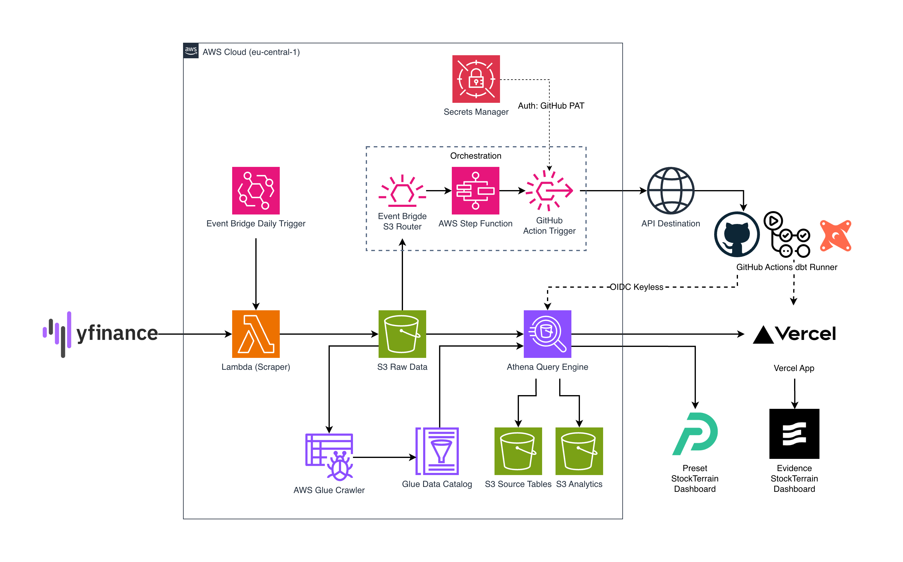
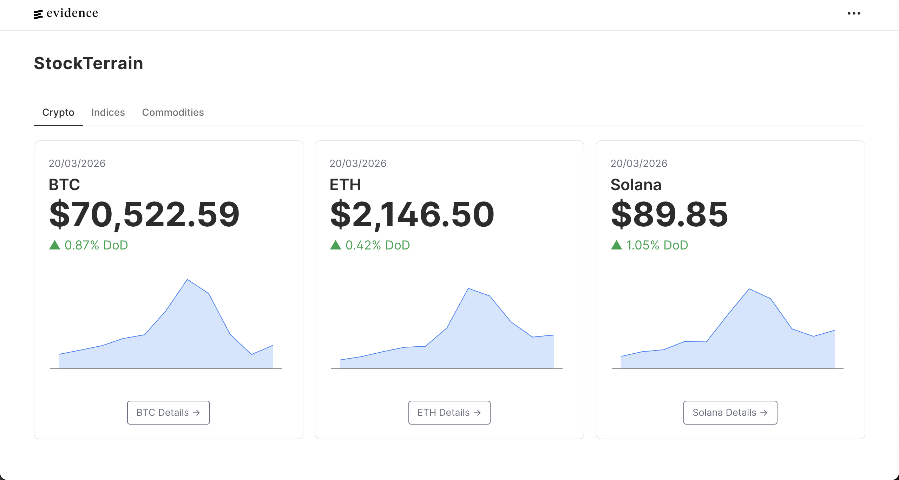
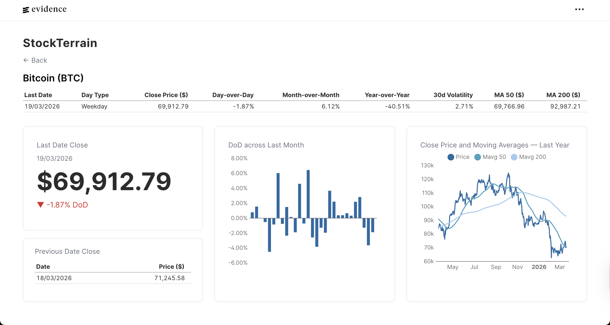
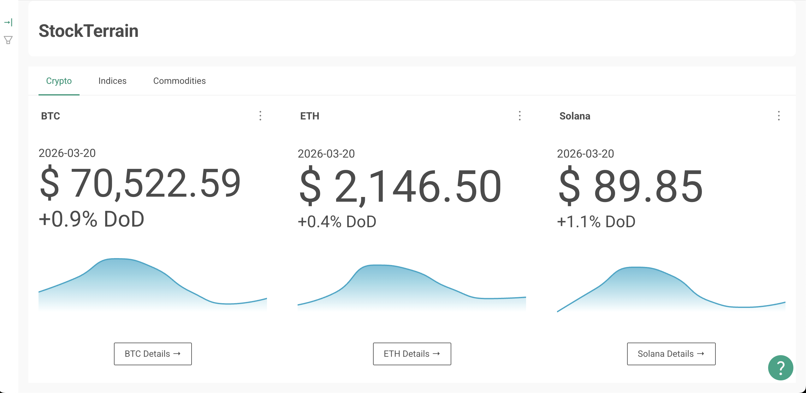
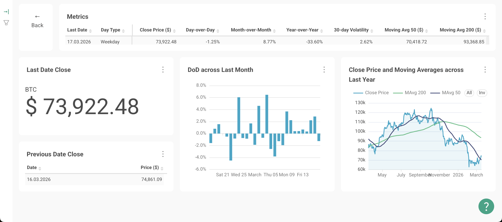

# StockTerrain – Market Analytics Platform
### Automated financial data pipeline and dashboards built with AWS, dbt, Terraform, and Preset

## Project Description
This project implements an end-to-end cloud data pipeline for market analytics. Daily price data from the Yahoo Finance API is ingested via AWS Lambda, stored in Amazon S3, and cataloged with AWS Glue for querying in Amazon Athena.

Data transformations and financial metrics are built with dbt and executed via GitHub Actions, while AWS Step Functions orchestrate the workflow. The processed datasets feed interactive dashboards in Evidence and Preset (Apache Superset), providing insights into price trends, returns, volatility, and moving averages across cryptocurrencies, commodities, and major stock indices.

## Architecture Diagram
  
*End-to-end pipeline from data ingestion to dashboards.*

## Evidence Dashboard
Interactive public dashboard built with Evidence.dev, deployed on Netlify.  
🔗 **[stockterrain.vercel.app](https://stockterrain.vercel.app/)**

*Main dashboard showing overview of all assets.*

*Detail view for Bitcoin with trends and metrics.*

## Preset Dashboards
  
*Main dashboard showing overview of all assets.*

  
*Detail view for Bitcoin with trends and metrics.*

## Key Metrics
- Daily, monthly, and yearly returns  
- 30-day rolling volatility  
- 50-day and 200-day moving averages

## Tools & Technologies
- **AWS**: Lambda, S3, Glue, Athena, Step Functions  
- **Terraform**: Infrastructure as code for AWS resources  
- **dbt**: Data transformations and modeling  
- **GitHub Actions**: CI/CD for dbt runs  
- **Python**: Data ingestion via yfinance
- **Evidence.dev**: Public-facing analytics app with SQL-driven markdown pages  
- **Vercel**: Static site hosting and deployment for the Evidence dashboard  
- **Preset (Apache Superset)**: Interactive dashboards and visualization

## Author
Aleksej Talstou  
[LinkedIn](https://www.linkedin.com/in/aliaxey-talstou/) | [GitHub](https://github.com/altal3000)
